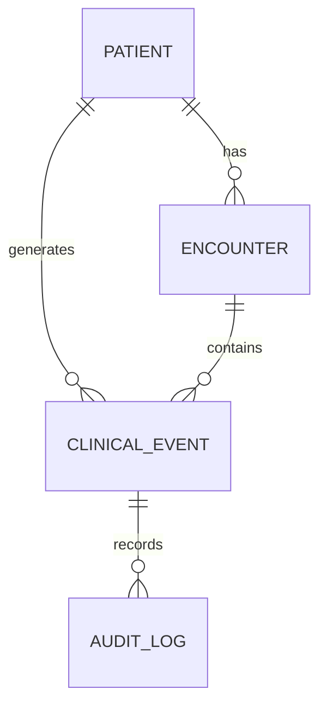

# Modelo de datos

```mermaid
erDiagram
PATIENT ||--o{ ENCOUNTER : has
PATIENT ||--o{ CLINICAL_EVENT : generates
ENCOUNTER ||--o{ CLINICAL_EVENT : contains
CLINICAL_EVENT ||--o{ AUDIT_LOG : records
```

## Entidades

- Patient
- Encounter
- ClinicalEvent
- AuditLog
